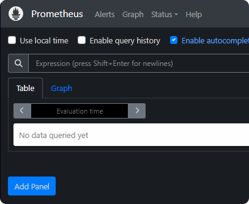

Configurer les identifiants de grafana dans .env.docker
`GF_SECURITY_ADMIN_USER=admin
GF_SECURITY_ADMIN_PASSWORD=admin`

Grafana:
http://localhost:3000

Prometheus:
http://localhost:9090

Apache
http://localhost:8080

http://localhost:8080/server-status/?auto

# Surveillez Apache avec Prometheus et Grafana
https://fr.linux-console.net/?p=21996